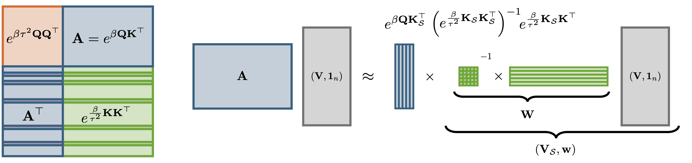
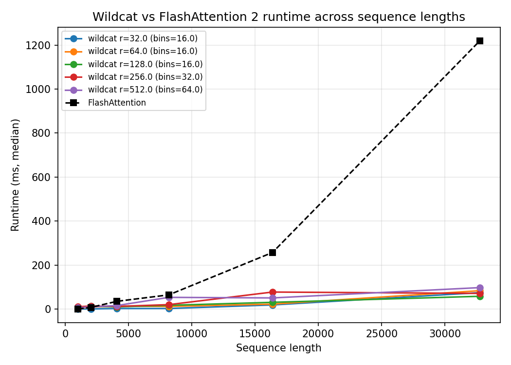

## Overview

WildCat (Weighted Iterative Low-rank Decomposition for Coreset ATtention) is a drop-in replacement for scaled dot-product attention that faithfully approximates exact attention in near-linear time. The core of WildCat is `compress_kv`, an efficient algorithm for compressing the key-value sequence into a small weighted coreset. WildCat can be used to either accelerate non-causal attention at inference time or to compress a pre-computed KV cache to near-constant size.

## How It Works
The goal of WildCat is the approximation of the softmax (or scaled dot-product) attention mechanism

$$\text{Attn}(Q, K, V) = \text{softmax}\left(\beta Q  K^\top \right) V$$

for $Q, K, V\in \mathbb R^{n\times d}$ and scale parameter $\beta = \sqrt{d}^{-1}$. Computing $\text{Attn}(Q, K, V)$ exactly requires evaluating all $n^2$ entries of the attention matrix $A = \exp\left(\beta Q  K^\top\right)$, giving quadratic time complexity in the sequence length $n$. WildCat avoids this cost by finding a **low-rank approximation** $\widehat{A} = \exp\left(\beta Q  K_{\mathcal S}^\top\right) W$ with $W \in \mathbb R^{r\times n}$ and $K_{\mathcal S}$ a small subset of $r$ rows of $K$. This factorisation reduces approximate attention to $O(nr)$ operations:

$$
\widehat{\text{Attn}}(Q, K, V) = \frac{\exp\left(\beta Q  K_{\mathcal S}^\top \right) (W V)}{\exp\left(\beta Q  K_{\mathcal S}^\top\right) (W\boldsymbol 1_{n})}
$$

#### A Nyström-based weighting scheme
The weights $W$ are chosen to minimise the feature-wise approximation error $\sum_{s \in \mathcal S}\exp(\beta\langle k_s, \cdot \rangle)W_{sl} \approx \exp(\beta\langle k_l, \cdot \rangle)$ for all rows $k_l \in \mathbb R^d$ of $K$. Solving the associated **regression** problem yields the Nyström weights

$$
W = \exp\left(\tfrac{\beta}{\tau^2} K_{\mathcal S}K_{\mathcal S}^\top\right)^{-1}\exp\left(\tfrac{\beta}{\tau^2} K_{\mathcal S}K^\top\right)\,.
$$

The parameter $\tau$ is a free parameter; we derive a closed-form expression that balances low-rank approximability of the key matrix against query-induced error inflation. A key advantage of WildCat is that all keys and values participate in forming the compressed representation, while no access to the queries is needed at compression time.

<p align="center">
  
</p>

#### Coreset selection through randomly pivoted Cholesky
The coreset indices $\mathcal S\subseteq \{1, 2, \dots, n\}$ and the Nyström weights $W$ are determined in tandem through an adaptation of the [randomly pivoted Cholesky](https://arxiv.org/abs/2207.06503) algorithm which we call `rp_nystrom`. As a result, the compression is fast and numerically stable, requiring only $O(nr^2)$ operations and no explicit matrix inversion. In our [paper](https://arxiv.org/abs/2602.10056) we show that a near-constant coreset size $r\in n^{o(1)}$ suffices to approximate attention with super-polynomial $O(n^{-\sqrt{\log\log n}})$ error decay — faster than any fixed polynomial $n^{-a}$. In consequence, WildCat offers a near-linear attention surrogate in theory and in practice.

---

## Runtime and Error Guarantees

WILDCAT enjoys the best of both worlds: it is both fast and accurate.

- **Near-linear runtime**: With a coreset of size *r ∈ n^o(1)*, WILDCAT runs in *O(nr²)* time — near-linear in the sequence length.
- **Super-polynomial error decay**: For bounded inputs, a near-constant coreset size suffices for *O(n^{−√log log n})* error decay. This is dramatically faster than the polynomial decay guaranteed by prior methods, and is the first practical algorithm to achieve super-polynomial error in near-linear time.

Prior work either required quadratic runtime for fast error decay, or only guaranteed slow near-constant decay in near-linear time. WILDCAT closes this theory-practice gap.

## Comparison to FlashAttention

The plot below shows WILDCAT runtime versus sequence length, compared to FlashAttention 2. FlashAttention already achieves impressive speed through IO-aware tiling, but its runtime still grows **quadratically** — visible as the rapidly accelerating dashed curve. WILDCAT's runtime remains nearly flat across all tested sequence lengths (up to 32,768 tokens), staying well below 100ms while FlashAttention exceeds 1,200ms at the longest sequences.

<p align="center">
  
</p>

Different curves correspond to different coreset sizes *r* (with the number of parallel bins *B* adjusted accordingly).

## KV Cache Compression

In autoregressive language models, past keys and values are stored in a **KV cache** that grows linearly with context length. WILDCAT's COMPRESSKV algorithm compresses this cache down to *O(r)* entries by running the coreset selection during the *prefill phase*. Subsequent generation then attends only over the compressed cache.

We evaluated COMPRESSKV on 13 long-context language understanding tasks from LongBench-E, using Qwen2.5-7B-Instruct. COMPRESSKV achieved the **highest average score** across all tasks, outperforming five leading KV cache compression methods (StreamingLLM, PyramidKV, BalanceKV, Uniform, and SnapKV) — all at 25% of the original cache size.

## Image Generation and Classification

Beyond language models, WILDCAT was evaluated as a drop-in replacement for exact attention in two vision benchmarks:

- **BigGAN image generation**: WILDCAT achieved the largest speed-up (3.71× over exact attention), the lowest Inception Score degradation (1.4%), and no degradation in Fréchet Inception Distance — outperforming Reformer, ScatterBrain, Performer, KDEformer, and Thinformer on all metrics simultaneously.
- **T2T-ViT image classification**: WILDCAT achieved the highest Top-1 accuracy among all approximations (82.18% vs. 82.55% for exact attention) while also running the fastest — an 11.6× speed-up on the dominant attention layer.

## Citation

[WildCat: Near-Linear Attention in Theory and Practice](https://arxiv.org/abs/2602.10056)

```bibtex
@article{schroder2026wildcat,
  title={WildCat: Near-Linear Attention in Theory and Practice},
  author={Schr{\"o}der, Tobias and Mackey, Lester},
  journal={arXiv preprint arXiv:2602.10056},
  year={2026}
}
```
