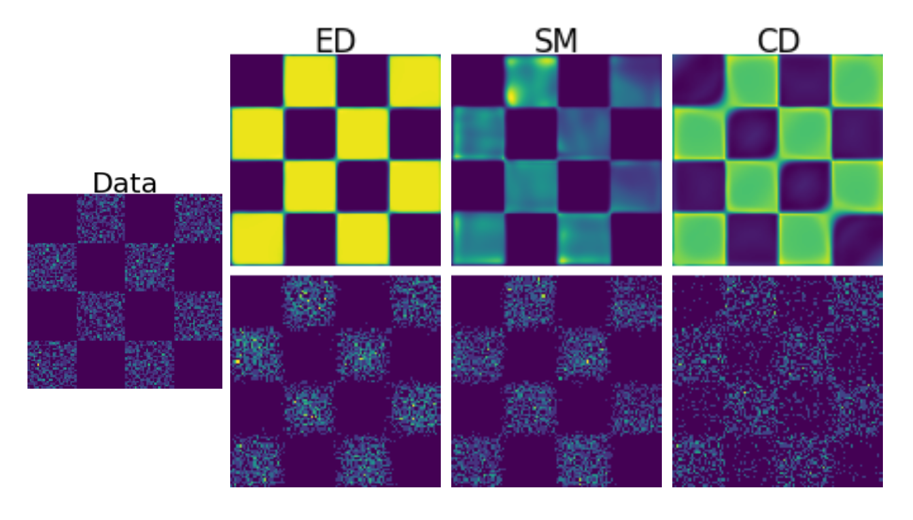
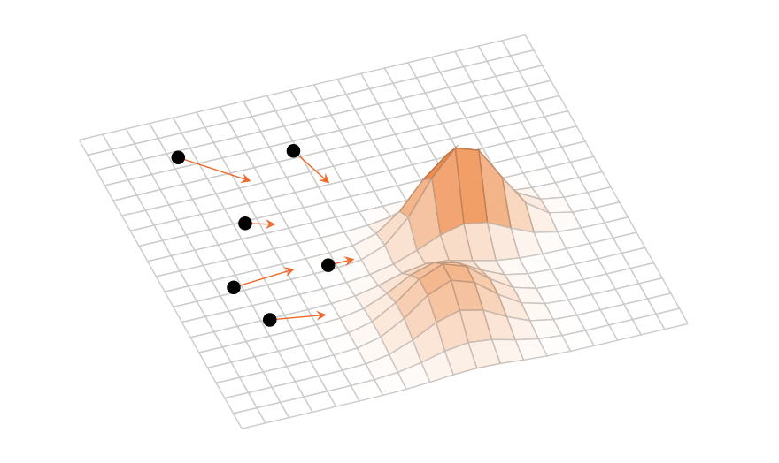

I am a PhD student in Mathematics at Imperial College London supervised by [Andrew Duncan](https://www.ma.imperial.ac.uk/~aduncan/) and [Greg Pavliotis](https://www.ma.imperial.ac.uk/~pavl/). My research focuses on probabilistic aspects of generative modeling, including the development of robust and theoretically grounded training methods for energy-based models. During my PhD, I was incredibly fortunate to work with [Lester Mackey](https://stanford.edu/~lmackey/) on scalable kernel density estimation with applications to large language models during an internship at [Microsoft Research New England](https://www.microsoft.com/en-us/research/lab/microsoft-research-new-england/). I received a Master's in Mathematics from [Heidelberg University](https://www.uni-heidelberg.de/en) and spent a wonderful exchange year at the [University of Washington](https://www.washington.edu). Before that, I received a Bachelor's degree in Mathematics and Physics from Heidelberg University. In this time, I worked on topics in Optimal Transport, continuum random trees, and spontaneous symmetry breaking in non-relativistic quantum field theories. My academic advisors in this time were [Thomas Gasenzer](https://www.kip.uni-heidelberg.de/gasenzer), [Anna Wienhard](https://www.mathi.uni-heidelberg.de/~wienhard/), [Soumik Pal](https://sites.math.washington.edu//~soumik/), and [Christoph Schnörr](https://ipa.math.uni-heidelberg.de/people.html).

## Summary
My research focuses on developing and analysing robust methodologies for unsupervised machine learning based on techniques from physics, mathematical analysis, and optimisation. Currently, I am working on an improved training methodology for energy-based models for generative modelling and inference.

## Projects
#### How to train your EBM without Markov Chain Monte Carlo
We propose a new training methodology for energy-based models based on Energy Discrepancy (ED) which does not rely on sampling (like contrastive divergence, short CD) or Stein scores (as in score-based methods, short SM). The goal are robust unbiased models for high-dimensional data. Our paper **"Energy Discrepancies: A Score-Independent Loss for Energy-Based Models"** can be accessed [here](https://arxiv.org/abs/2307.06431). An extension to energy-based models on discrete spaces has been presented at the ICML 2023 workshop *Sampling and Optimisation in Discrete Spaces* and can be found [here](https://arxiv.org/abs/2307.07595)

#### Variational Inference as a gradient flow in a kernelised Wasserstein geometry
Variational Inference optimises a training objective with gradient descent to infer optimal parameters in a parametric family of distributions, for example, to compute an approximate Bayesian posterior distribution. For my Master thesis, I formulated the training dynamics as a gradient flow in a kernelised Wasserstein geometry based on the results on [Stein geometries](https://arxiv.org/abs/1912.00894) and a [relationship between gradient flows and black box variational inference](https://arxiv.org/abs/2004.01822)

