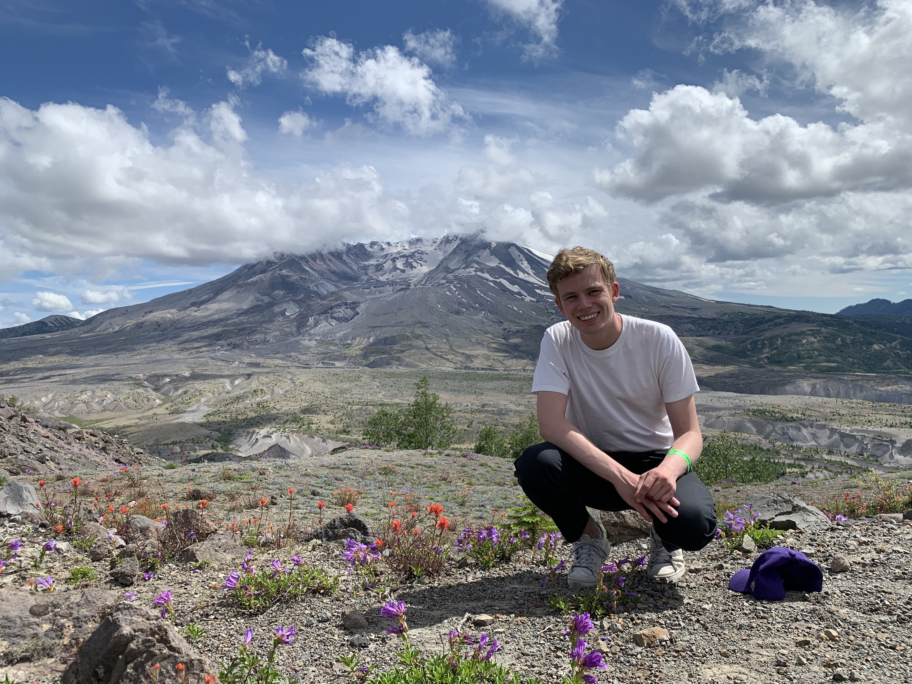

I am a PhD student in Mathematics at Imperial College London supervised by [Andrew Duncan](https://www.ma.imperial.ac.uk/~aduncan/) and [Greg Pavliotis](https://www.ma.imperial.ac.uk/~pavl/).

## Summary
My research focuses on developing and analysing robust methodologies for unsupervised machine learning based on techniques from physics, mathematical analysis, and optimisation. Currently, I am working on an improved training methodology for energy-based models for generative modelling and inference.
